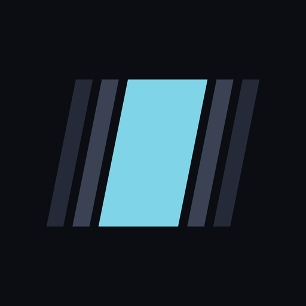
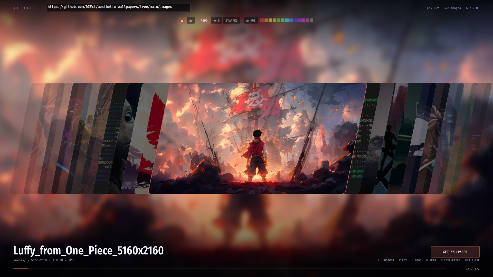
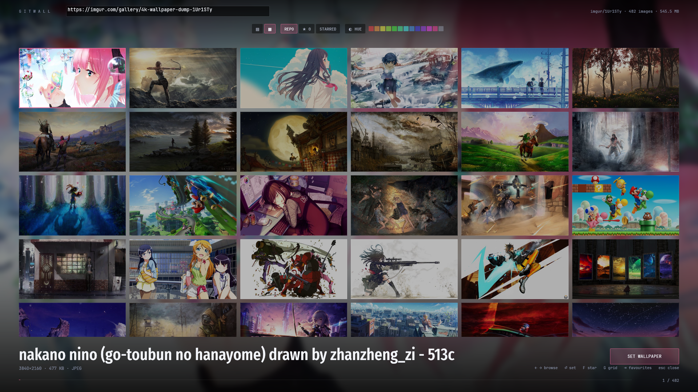

<div align="center">



# gitwall

**A full-screen wallpaper picker that reads its collection from any GitHub repo or Imgur album.**

</div>



The focused wallpaper fills the screen behind the strip, so you preview it
full-size before committing to it.



<kbd>G</kbd> switches to a grid.


Paste a repository URL, scroll the sheared slice carousel, press Enter. The
interaction follows [skwd-wall](https://github.com/liixini/skwd-wall)'s slices
view; the difference is where the wallpapers come from — a git repo pinned to a
commit, rather than a local folder — and that this runs on GNOME, which
skwd-wall cannot (it needs `wlr-layer-shell`).

```
gitwall                                                      # history / start empty
gitwall github.com/D3Ext/aesthetic-wallpapers                # a repo
gitwall imgur.com/gallery/4k-wallpaper-dump-1Ur1STy          # an imgur album
gitwall "world of warcraft"                                  # search
```

## Sources

| paste | notes |
| --- | --- |
| `github.com/owner/repo` | also `/tree/<ref>/<subdir>`, `/blob/...`, `owner/repo`, ssh form |
| `imgur.com/gallery/<slug-hash>` | also `imgur.com/a/<hash>` |
| `imgur.com/t/<tag>` | **not supported** — a tag is a feed of many posts, not one album. Open a post from it. |
| anything else | treated as a **search**, via [Wallhaven](https://wallhaven.cc). Type `world of warcraft`. |

Search is the fallback: anything that doesn't parse as a URL or as
`owner/repo` becomes a query. Wallhaven's API needs no key and returns SFW
results only without one; set `WALLHAVEN_API_KEY` if you want your own account's
settings. Categories are set explicitly to General + Anime + People.

A search loads 120 results up front and pulls more as you scroll toward the
end, two pages at a time. The top-right badge tracks it: `wallhaven · 216 of
6086 results`. Rate limit is 45 requests/minute.

Imgur is the better-behaved source of the two: it reports dimensions and byte
sizes up front, and it serves native ~640 px thumbnails. A 545 MB / 482-image
album browses for about 24 MB. GitHub has no thumbnail service, so previews
there mean downloading originals.

Imgur's official API returns 429 without a registered Client-ID, so the album is
read from the gallery page's embedded `postDataJSON`. That is a scrape; if Imgur
changes their markup you'll get a stated error rather than an empty gallery.

## How it handles a 683 MB repo

That example repo is 372 images averaging 1.8 MB. Downloading it to browse it
would be absurd, so nothing is fetched until you scroll near it:

- **Two API calls per repo.** One pins the ref to a commit, one pulls the whole
  tree. Image bytes come from jsDelivr, which doesn't touch the API rate limit.
  Set `GITHUB_TOKEN` to lift 60 req/hr to 5000 if you flip between many repos.
- **Thumbnails are generated locally** at 640 px and cached — roughly 35x
  smaller than the source. Browsing the whole repo costs ~15 MB of cache.
- **Full resolution is downloaded for exactly one image:** the one you pick.
- **Everything is keyed by git blob sha**, so the cache is content-addressed —
  correct invalidation for free, and identical wallpapers dedupe across repos.

## Where things go

| Path | Holds | Safe to delete |
| --- | --- | --- |
| `~/.cache/gitwall/thumbs` | thumbnails + accent/dimension sidecars | yes |
| `~/.cache/gitwall/full` | full-res originals of images you applied | yes |
| `~/.cache/gitwall/listings` | repo trees, 6 h TTL | yes |
| `~/.local/share/gitwall/current` | the wallpaper the desktop points at | **no** |

The applied wallpaper is copied out of the cache on purpose: pointing the
desktop at a cache file means clearing the cache blanks your background.

## Desktops

Detected from the environment, most specific first. Override with
`GITWALL_BACKEND=<name>`.

| Backend | Needs |
| --- | --- |
| `gnome` | `gsettings` — sets `picture-uri` and `picture-uri-dark` |
| `plasma` | `plasma-apply-wallpaperimage` |
| `swww` | `swww` (wlroots: sway, Hyprland, river) — daemon auto-started |
| `hyprpaper` | `hyprctl` |
| `swaybg` | `swaybg` |
| `feh` | `feh` (X11) |

## Keys

| | |
| --- | --- |
| <kbd>←</kbd> <kbd>→</kbd> | browse (<kbd>↑</kbd>/<kbd>↓</kbd> jumps a row, <kbd>PgUp</kbd>/<kbd>PgDn</kbd> further) |
| <kbd>Enter</kbd> | set the focused wallpaper |
| <kbd>F</kbd> | star / unstar |
| <kbd>G</kbd> | slices ⇄ grid |
| <kbd>S</kbd> | sort by hue |
| <kbd>Tab</kbd> | switch between this collection and your favourites |
| <kbd>/</kbd> | jump to the source field |
| <kbd>Esc</kbd> | close |

Mouse: grab the wallpapers and flick them — the release speed carries into a
coast that settles on a slice. In the grid the same drag scrolls vertically.
Scroll wheel still works, click focuses, and clicking the focused one applies.
A press that moves less than a few points stays a click, so tapping still
selects. The
toolbar carries the same controls plus a section filter and a colour-swatch
filter.

The field at the top takes all three kinds of input — a repo URL, an Imgur
album, or a search phrase. The start screen lists what you have opened before;
click one to reopen it, or the <kbd>✕</kbd> on its right to forget it.

Favourites and history live in `~/.local/share/gitwall/`. A favourite stores its
own URLs rather than repo coordinates, so one starred list spans GitHub repos
and Imgur albums together, and keeps working without re-resolving anything.

**Colour filtering only knows about images it has fetched.** There is no way to
learn a wallpaper's dominant colour without downloading it, so the toolbar
states the coverage ("colour known for 44 of 372") rather than quietly showing
you a partial collection. On Imgur, where previews are ~48 KB, covering a whole
album is cheap.

## Install

```sh
./tools/install.sh           # builds release, then installs
./tools/install.sh --no-build
./tools/install.sh --uninstall
```

That puts the binary in `~/.local/bin`, icons in the hicolor theme, and a
desktop entry in `~/.local/share/applications` — so `gitwall` works in a shell
and the app shows up in the menu. The entry sets `StartupNotify=false`: winit
doesn't report startup completion, and without that the desktop leaves a busy
cursor spinning until its own timeout expires — outliving the app itself. Re-run it after every rebuild; it copies the
binary rather than symlinking, so `cargo build` alone won't update what's
installed.

### Bind it to a key

It's built to be launched on a hotkey and dismissed with <kbd>Esc</kbd>. On
GNOME, Settings → Keyboard → View and Customize Shortcuts → Custom Shortcuts,
with the command set to `gitwall`. Or from a terminal:

```sh
P=/org/gnome/settings-daemon/plugins/media-keys/custom-keybindings/gitwall/
gsettings set org.gnome.settings-daemon.plugins.media-keys custom-keybindings "['$P']"
gsettings set org.gnome.settings-daemon.plugins.media-keys.custom-keybinding:$P name 'gitwall'
gsettings set org.gnome.settings-daemon.plugins.media-keys.custom-keybinding:$P command 'gitwall'
gsettings set org.gnome.settings-daemon.plugins.media-keys.custom-keybinding:$P binding '<Super>w'
```

Note the first line **replaces** your custom keybinding list. If you already
have custom shortcuts, read the current value first and append to it instead.

## Build

```sh
cargo build --release        # -> target/release/gitwall
```

Rust only — no Node, no webview, no system GUI toolkit beyond what winit and
wgpu pull in. Rendering goes through wgpu (Vulkan here).

`GITWALL_WINDOWED=1` starts windowed instead of fullscreen.

### Why not a webview

This started as a Tauri app. On an NVIDIA card WebKitGTK's DMABUF renderer
fails outright — `Failed to create GBM buffer`, blank window — under both X11
and native Wayland. Disabling that renderer is the standard workaround, but it
drops WebKit onto a software compositing path. Measured on a 1600x900 window,
stress-scrolling the strip:

| build | frame time |
| --- | --- |
| WebKit, everything on | 104 ms (13.6 fps) |
| WebKit, minus the backdrop blur | 76 ms |
| WebKit, minus blur, width animation, shadows, text-shadows | 57 ms |
| **wgpu** | **smooth** |

57 ms was the floor with essentially every effect removed, so it wasn't
something CSS could fix. The whole UI layer was replaced; `gitwall-core` did
not change, which was the point of keeping it UI-free from the start.

## Layout

```
crates/gitwall-core/   all logic, no UI dependency — cargo test runs headless
  source.rs            URL parsing, GitHub tree -> pinned image list
  cache.rs             XDG paths, sha-sharded storage, listing TTL
  fetch.rs             bounded + deduplicated + retrying downloader
  thumb.rs             decode, downscale, extract the accent colour
  wallpaper.rs         desktop detection and applying
crates/gitwall-ui/     the picker
  geom.rs              sheared slices as textured meshes
  theme.rs             palette, fonts, slice metrics
  bridge.rs            tokio runtime <-> render loop
  app.rs               state, input, painting
```

## Design notes

- **Slice geometry** is one number. Everything — slice width, overlap, lean,
  expanded width — derives from slice height as a ratio, in `theme::Metrics`.
  The lean is a pixel offset over the height, not a fixed angle. `R_SKEW` is
  the dial worth touching.
- **The strip animates on a fractional focus.** Slice widths and positions are
  continuous functions of one float, so motion is interpolated rather than
  stepped, and the position maths is closed-form — the cost is the same for 10
  images or 10 000.
- **The image stays upright inside a sheared slice** because each vertex's UV
  is derived from its screen position rather than from the quad's corners. The
  net texture-to-screen transform has no shear in it, so the parallelogram acts
  as a window. `geom.rs` has the details; there's a test asserting it.
- **The blurred backdrop costs nothing per frame.** It's a 420 px image drawn
  across the whole screen — GPU bilinear filtering does the blurring. There is
  no blur pass anywhere.
- **The chrome borrows its colour from the focused image.** A dominant hue is
  extracted during thumbnailing and clamped into a band that stays legible on
  near-black, then drives the selection ring, the progress line and the ambient
  backdrop. Greyscale images fall back to a cool cyan.
- **Type follows the mechanic.** Fira Sans Compressed for the wallpaper name —
  compressed, like the slices. JetBrains Mono for everything the machine knows:
  paths, shas, counts, dimensions.
